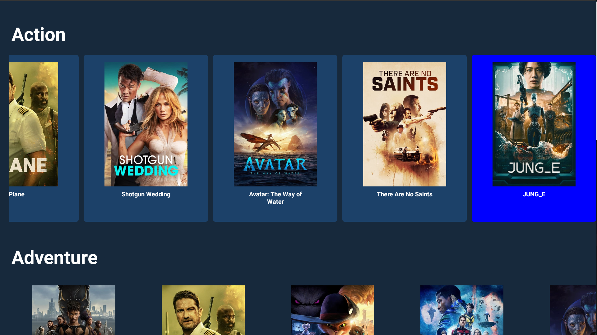

# :tv: JP Software House





## :computer: Sobre

Aplicação para um processo seletivo. Consiste em um app para TVs. 


## 👨‍💻 Requisitos


* Desenvolver um aplicativo utilizando o framework React Native para Android e iOS.
* Utilizar o pacote react-native-tvos 
* o projeto precisa rodar em um simulador de Android TV 11 e 12


## :hammer: Ferramentas


* Typescript
* React Native


<br />
<hr />

## :sparkles: Executando a aplicação

<details>
  <summary markdown="span"><strong>Via Simulador</strong></summary><br />
  
  
  > Após clonar o repositório, execute os seguintes comandos:
  
  ##### Instalar as dependências
  ```bash
  expo install
  ```

  ##### Iniciar o projeto
  ```bash
  expo start
  ```


<br />
</details>


<br />
<hr />

